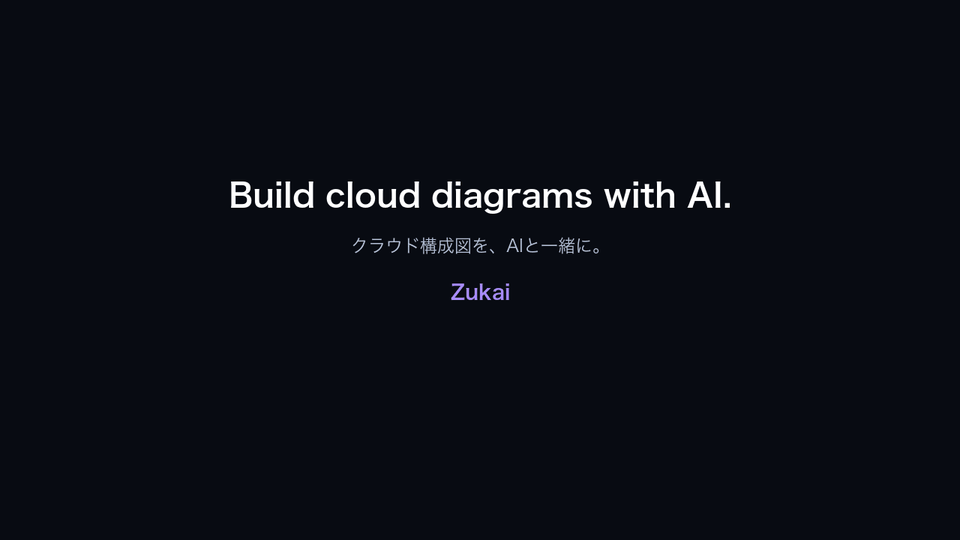

# Zukai

<p align="center">
  <a href="https://satachito.github.io/Zukai/">
    
  </a>
</p>

<p align="center">
  <strong>Build cloud diagrams with AI.</strong><br>
  クラウド構成図を、AIと一緒に。<br><br>
  <a href="https://satachito.github.io/Zukai/"><strong>Try Zukai →</strong></a>
</p>

Canvas-based diagram editor for **cloud architecture**, **mind maps**, and **sequence diagrams**.

**Live demo:** https://satachito.github.io/Zukai/

Open the page and start drawing — no build step for the hosted demo. Diagrams are plain JSON (`.zu` files), editable by hand or with AI in Cursor.

## Features

- **4096 × 4096 canvas** with pan/zoom
- **Shapes** — rect, ellipse, rhombus, SVG, PNG
- **Links** with arrowheads, anchor points, and orthogonal routing
- **Cloud icon palettes** — AWS, Azure, GCP, and Lucide line icons (ZIP archives under `ICONs/`)
- **Sample diagrams** — MultiCloud, cloud layouts, mind map, sequence, showcase
- **Import / export** — load and save `.zu` files (↑ / ↓ buttons)
- **Session restore** — last diagram is kept in `localStorage`
- **Light / dark mode** — follows system preference
- **AI editing** — in-app Claude / OpenAI panels (bring-your-own key), plus a dev server with live `.zu` reload, `window.ZU` command API, and Cursor MCP for natural-language diagram changes (see **[USAGE.md](USAGE.md)**)

## Quick start (demo)

1. Open the [live demo](https://satachito.github.io/Zukai/).
2. Click a **Sample( … )** button on the right panel to load an example.
3. Drag on the canvas to move nodes; use the mode selector to create nodes and links.
4. Expand **GCP / Azure / AWS / Lucide** in the left panel to place icons.
5. Press **↓** to download the diagram as a `.zu` file.

## Local development & AI workflow

For editing in Cursor with **save → browser preview**, **live MCP control**, or chat commands like *“make the VPN band 1.2× taller”*:

```bash
cd Web && npm install && npm run dev
cd ../tools && npm install   # MCP (one-time)
```

Open `http://localhost:8281/?zu=Samples/MultiCloud.zu` and enable the **`zukai`** MCP server in Cursor (**Settings → Tools & MCP**).

Full setup, Phase 2/3/4 explanation, MCP tools, and troubleshooting: **[USAGE.md](USAGE.md)**

## `.zu` format

A saved `.zu` file is JSON:

```json
{
	"model": {
		"nodes": [],
		"links": []
	}
}
```

Each node is `[ ID, area, paint ]`. Each link is `[ [ fromID, toID ], ends, paint ]`.

Authoring rules for AI and hand edits: **[Web/SCHEMA.md](Web/SCHEMA.md)** · **[AI.md](AI.md)** (AI contract + MCP)  
Sample files: **[Samples/](Samples/)**

## Editing with AI

Zukai has two **in-app AI panels** (bring-your-own API key) — a Claude panel and
an OpenAI panel — plus on-disk and MCP workflows. Typical workflows:

| Goal | How |
|------|-----|
| Chat with the diagram inside the app | In-app **Claude** or **OpenAI** panel (paste your API key; stored in `localStorage` — see [USAGE.md](USAGE.md) trust notes) |
| Edit `.zu` on disk, preview on save | Phase 2 — `npm run dev` + `?zu=Samples/….zu` |
| Change the open diagram from Cursor chat | Phase 4 — MCP (`zu_get_model`, `zu_apply`, …) |
| One-off file load on GitHub Pages | **↑** upload or a Sample button |

Tips:

- Prefer **rect / ellipse / rhombus** over new base64 icons unless you need a specific glyph.
- Keep **node IDs stable**; every link must reference existing IDs.
- Use samples as layout references — **[Samples/Sequence.zu](Samples/Sequence.zu)**, **[Samples/MindMap.zu](Samples/MindMap.zu)**, **[Samples/MultiCloud.zu](Samples/MultiCloud.zu)** for cloud architecture.

Cursor rules: **[Web/.cursorrules](Web/.cursorrules)**, **[Web/CLAUDE.md](Web/CLAUDE.md)** → `SCHEMA.md`.

## Run locally (static only)

No live reload or MCP — just preview the app:

```bash
cd Web
python3 -m http.server 8281
# http://localhost:8281/index.html
```

`Web/Samples` symlinks to `../Samples`. Icon ZIPs symlink from `ICONs/`.

## Lint & deploy

```bash
cd Web && npm run lint
```

GitHub Pages deploys from `Web/` on push to `main` (`.github/workflows/pages.yml`).

## Project layout

```
Zukai/
├── Web/              App (HTML + ES modules, ai-api.js)
├── Samples/          Example .zu files
├── ICONs/            Cloud icon ZIP archives
├── tools/            zu-server, zu-mcp, utilities
├── .cursor/mcp.json  Cursor MCP config
├── USAGE.md          Dev server + MCP workflow
├── AI.md             AI contract + MCP ops
└── Web/SCHEMA.md     .zu schema reference
```

## Author

Satoru Ogura — with help from AIs.

## License

Zukai application code is **ISC**.

Third-party assets are **not** covered by that license:

| Asset | Source | Terms |
|-------|--------|--------|
| AWS architecture icons (`ICONs/Asset-Package_…zip`) | [AWS Architecture Icons](https://aws.amazon.com/architecture/icons/) | AWS trademark / site terms — for architecture diagrams and technical materials; do not alter marks or imply AWS endorsement |
| Azure architecture icons (`ICONs/Azure_Public_Service_Icons_….zip`) | [Azure Architecture Icons](https://learn.microsoft.com/en-us/azure/architecture/icons/) | Microsoft permits use in architectural diagrams, training materials, or documentation only; all other rights reserved |
| Google Cloud icons (`ICONs/google-cloud-*.zip`, `Google-Cloud-Icons.zip`, …) | [Google Cloud icon library](https://cloud.google.com/icons) | Google brand guidelines — for diagrams and technical documentation; do not modify or use as your own product branding |
| Lucide icons (`ICONs/lucide-line-icons.zip`; a subset is also embedded in `Samples/MultiCloud.zu`) | [Lucide](https://lucide.dev) via `lucide-static` (some icons derived from [Feather](https://feathericons.com)) | Lucide **ISC**; Feather-derived icons **MIT** — see `LICENSE` / `NOTICE.txt` in the ZIP. Icons are grouped by Lucide categories in the left panel |

Samples such as `AWS.zu` / `Azure.zu` / `GCP.zu` embed a few official icons for diagram demos. Redistributing or shipping the full `ICONs/` ZIP archives remains subject to each vendor’s terms above, not Zukai’s ISC license.
